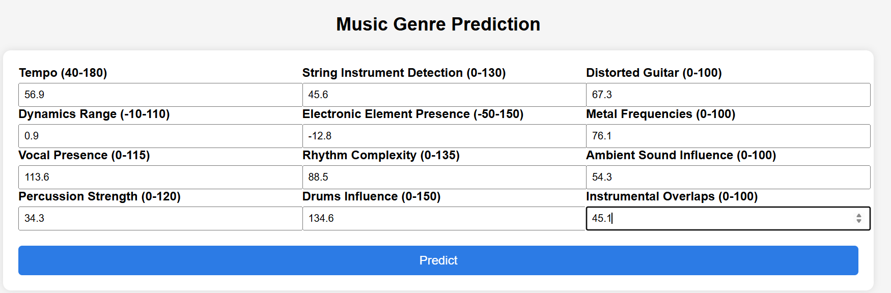

# 🎵 Music Genre Classification – End-to-End Machine Learning Project
## Overview
This project is a **production-grade machine learning system** that predicts the **genre of a music track** based on extracted audio features.  
It follows **industry best practices** including modular code structure, dimensionality reduction, model validation, hyperparameter tuning, and cloud deployment.

The system is built to be **scalable, maintainable, and deployment-ready**, making it suitable for real-world ML applications and portfolio presentation.

---

## Screenshots
### Web Application Interface
The Flask-based web application provides a clean and user-friendly interface for entering audio feature values and predicting the music genre.

#### Home Page – Input Form


#### Prediction Result


**Live Application:**
[Music Genre Classification Webapp](https://music-genre-prediction-wft4.onrender.com)

---

## Problem Statement
Automatically classifying music genres is a core problem in:
- Music recommendation systems
- Audio content organization
- Streaming platforms (e.g., Spotify, YouTube Music)

The challenge lies in handling **high-dimensional, correlated audio features** while maintaining strong generalization performance.

---

## Tech Stack
- Python
- Pandas
- NumPy
- Scikit-learn
- Flask
- Gunicorn
- Render (Cloud Deployment)

---

## Key Features
- End-to-end ML pipeline (ingestion → preprocessing → modeling → deployment)
- Dimensionality Reduction using **PCA**
- Model comparison and selection using **Macro F1-score**
- Cross-validation and hyperparameter tuning
- Modular, production-ready codebase (PEP 8 compliant)
- Flask-based web application
- Cloud deployment on **Render**

---

## Key Takeaways
- Demonstrates **real-world ML system design**
- Strong focus on **model generalization**
- Clean separation of concerns
- Production-ready deployment

---

## Dataset Description

| Feature | Description |
|-------|------------|
| Tempo | Beats per minute (BPM) |
| Dynamic Range | Loudness variation in decibels |
| Vocal Presence | Prominence of vocals |
| Percussion Strength | Intensity of percussion instruments |
| String Instrument Detection | Presence of string instruments |
| Electronic Element Presence | Usage of electronic elements |
| Rhythm Complexity | Complexity of rhythmic patterns |
| Drums Influence | Impact of drums in the track |
| Distorted Guitar | Use of distorted guitar sounds |
| Metal Frequencies | Presence of metal-associated frequencies |
| Ambient Sound Influence | Usage of ambient sounds |
| Instrumental Overlaps | Instrument interaction complexity |
| Genre | Target variable (categorical) |

---

## Machine Learning Pipeline

### 1. Data Ingestion
- Schema validation
- Integrity checks
- Logging and error handling

### 2. Preprocessing
- Missing value handling
- Feature scaling using **StandardScaler**
- Target encoding

### 3. Dimensionality Reduction
- **PCA (Principal Component Analysis)**
- Retains 85% variance
- Reduces multicollinearity
- Improves training efficiency

### 4. Model Training
- Logistic Regression (baseline + final model)
- Stratified train-test split

### 5. Model Evaluation
- Accuracy
- **Macro F1-score**
- Confusion Matrix
- Classification Report

### 6. Cross-Validation & Tuning
- 5-fold cross-validation
- GridSearchCV for hyperparameter tuning
- Model selection based on Macro F1-score

---

## Web Application
- Built using **Flask**
- HTML form-based input
- Consistent preprocessing during inference

---

## Deployment
- Deployed on **Render**
- Gunicorn WSGI server
- CI/CD via GitHub integration

**Live Application:**
[Music Genre Classification Webapp](https://music-genre-prediction-wft4.onrender.com)

---

## Installation & Local Setup

### Clone Repository
```
git clone https://github.com/Basharat-Asghar/Music_Genre_Classification_with-Dimensionality_Reduction.git

cd Music_Genre_Classification_with-Dimensionality_Reduction
```

### Install Dependencies
`pip install -r requirements.txt`

### Run Application
`python app.py`

---

## Author
**Muhammad Basharat Asghar** \
Entry-Level Data Scientist \
[LinkedIn](https://www.linkedin.com/in/basharat-asghar/)
[Portfolio](https://basharat-asghar.github.io/BasharatPortfolio/)